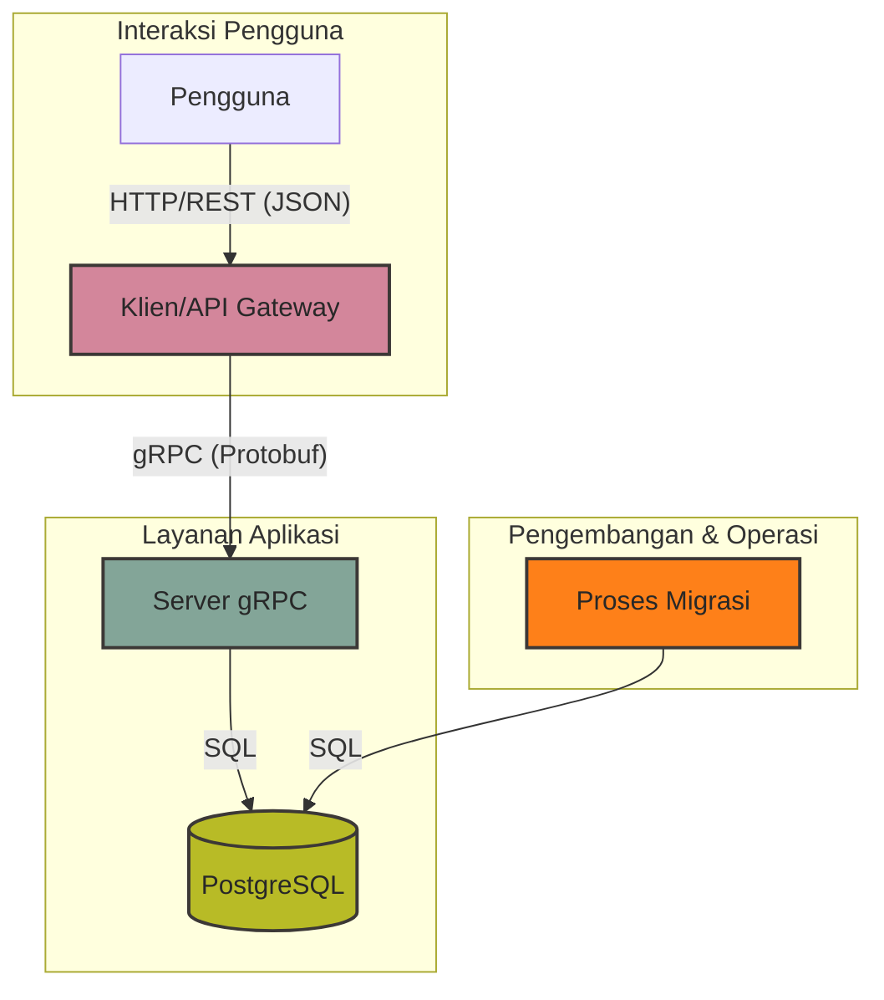
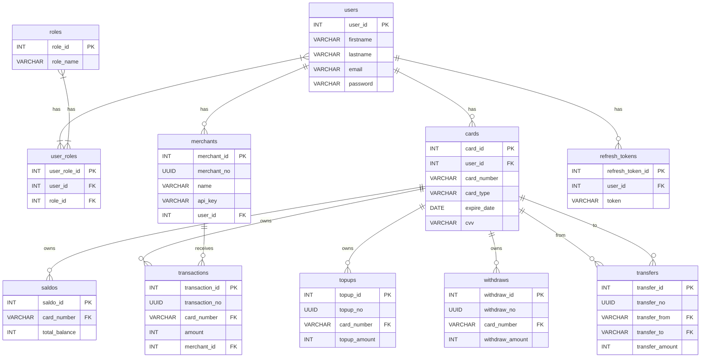

# Proyek Payment Gateway gRPC

### **Selamat Datang di Proyek Payment Gateway!**
Sistem ini menyimulasikan gateway pembayaran yang menangani operasi seperti transaksi kartu, top-up, penarikan, dan transfer. Proyek ini dibangun dengan Go dan menggunakan gRPC untuk komunikasi antar layanan.

--- 
## ✨ Tentang Proyek

Proyek ini merupakan **implementasi sistem pembayaran sederhana** yang dirancang untuk meniru alur kerja layanan keuangan digital pada umumnya. Sistem ini dibangun dengan pendekatan modular, sehingga setiap layanan dapat berdiri sendiri namun tetap saling terhubung melalui basis data dan API yang konsisten.

### Layanan Utama

Beberapa komponen penting yang menjadi inti dari proyek ini meliputi:

* **🔐 Otentikasi Pengguna**
  Mendukung pendaftaran akun baru, login dengan kredensial, serta penerbitan dan validasi token JWT. Sistem ini juga dilengkapi manajemen refresh token untuk menjaga keamanan sesi pengguna.

* **💳 Manajemen Kartu**
  Setiap pengguna dapat menambahkan kartu ke akun mereka. Detail kartu seperti nomor, tipe kartu, tanggal kadaluarsa, dan CVV disimpan dengan aman, serta dapat diakses kembali sesuai kebutuhan transaksi.

* **🏬 Manajemen Merchant**
  Merchant dapat dibuat dan diatur melalui sistem. Setiap merchant memiliki identitas unik berupa nomor merchant (UUID) dan API key yang digunakan untuk memproses transaksi.

* **💸 Transaksi**
  Menangani proses pembayaran antara kartu pengguna dan merchant. Setiap transaksi dicatat dengan nomor unik, jumlah pembayaran, serta informasi terkait merchant penerima.

* **🔄 Transfer Dana**
  Memungkinkan pengguna untuk melakukan transfer saldo antar kartu. Sistem mencatat asal (from) dan tujuan (to) transfer, serta memastikan saldo mencukupi sebelum transaksi diproses.

* **📈 Top-Up Saldo**
  Pengguna dapat menambahkan dana ke kartu mereka melalui proses top-up. Setiap top-up memiliki identitas unik dan secara otomatis memperbarui saldo kartu terkait.

* **🏧 Penarikan (Withdraw)**
  Pengguna dapat menarik dana dari kartu mereka. Sama seperti top-up, proses ini tercatat dan saldo diperbarui sesuai jumlah penarikan.

* **💰 Manajemen Saldo**
  Semua kartu terhubung dengan entitas saldo. Sistem bertanggung jawab untuk melacak, menambah, dan mengurangi saldo secara konsisten setelah setiap operasi keuangan (transaksi, transfer, top-up, atau penarikan).

---


## 🚀 Penambahan Fitur Proyek
- **REST API Client**: Klien RESTful yang berinteraksi dengan server gRPC.
- **gRPC Server**: Server utama yang menangani semua logika bisnis.
- **Migrasi Database**: Menggunakan `goose` untuk mengelola skema database.
- **Dokumentasi API**: Dokumentasi Swagger yang dibuat secara otomatis.
- **Docker Support**: Konfigurasi Docker dan Docker Compose untuk lingkungan pengembangan yang mudah.
- **Unit & Integration Tests**: Pengujian untuk memastikan keandalan kode.
- **CI/CD**: Alur kerja GitHub Actions untuk build, format, dan pengujian otomatis.

## 🧰 Tech Teknologi

- 🐹 **Go (Golang)** — Bahasa implementasi.
- 🌐 **Echo** — Kerangka kerja web minimalis untuk membangun REST API.
- 🪵 **Zap Logger** — Pencatatan terstruktur untuk aplikasi berkinerja tinggi.
- 📦 **SQLC** — Menghasilkan kode Go yang aman dari tipe dari kueri SQL.
- 🚀 **gRPC** — RPC berkinerja tinggi untuk komunikasi layanan internal.
- 🧳 **Goose** — Alat migrasi untuk mengelola perubahan skema database.
- 🐳 **Docker** — Platform kontainerisasi untuk lingkungan pengembangan yang konsisten.
- 📄 **Swago** — Menghasilkan dokumentasi Swagger 2.0 untuk rute Echo.
- 🔗 **Docker Compose** — Mengelola aplikasi Docker multi-kontainer.

---

## Arsitektur
Aplikasi ini dirancang dengan arsitektur berorientasi layanan monolith (monolith). REST API yang menghadap klien bertindak sebagai gateway, menerjemahkan permintaan HTTP menjadi panggilan gRPC ke server backend. Server ini berisi logika bisnis inti dan berkomunikasi dengan database PostgreSQL.



---

## Skema Database (ERD)
Diagram berikut mengilustrasikan hubungan antar tabel dalam database.



---

## Memulai
Anda dapat menjalankan proyek ini baik secara lokal dengan lingkungan Go atau menggunakan Docker.

### Prasyarat
- Go (versi 1.21 atau lebih baru)
- Docker dan Docker Compose
- Alat baris perintah `make`
- Sebuah file `.env` dengan variabel lingkungan yang diperlukan. Anda dapat menyalin dari `docker.env` sebagai template.

### 1. Clone Repositori
```bash
git clone https://github.com/hoover/payment-gateway-grpc.git
cd payment-gateway-grpc
```

### 2. Menjalankan dengan Docker (Disarankan)
Ini adalah cara termudah untuk menjalankan semua layanan.

1.  **Buat File Lingkungan:**
    Salin `docker.env` ke file `.env` baru.
    ```bash
    cp docker.env .env
    ```

2.  **Bangun dan Jalankan Layanan:**
    Gunakan perintah `make` untuk membangun image dan memulai kontainer dalam mode detached.
    ```bash
    make docker-up
    ```
    Ini akan memulai layanan `postgres`, `migrate`, `server`, dan `client`. Klien akan tersedia di `http://localhost:5000`.

3.  **Menghentikan Layanan:**
    Untuk menghentikan semua kontainer yang berjalan, gunakan:
    ```bash
    make docker-down
    ```

### 3. Menjalankan Secara Lokal

1.  **Mulai Database:**
    Anda dapat menggunakan file Docker Compose yang disediakan untuk hanya menjalankan database PostgreSQL.
    ```bash
    docker-compose up -d postgres
    ```

2.  **Siapkan Lingkungan:**
    Buat file `.env` di direktori root dan isi detail koneksi database serta variabel lain yang diperlukan.

3.  **Jalankan Migrasi Database:**
    Terapkan skema database terbaru.
    ```bash
    make migrate
    ```

4.  **Jalankan Layanan:**
    Buka dua jendela terminal terpisah.

    Di terminal pertama, jalankan server gRPC:
    ```bash
    make run-server
    ```

    Di terminal kedua, jalankan klien:
    ```bash
    make run-client
    ```
    API klien akan dapat diakses di `http://localhost:5000`.

---

## Perintah `make` yang Tersedia

- `migrate`: Menerapkan migrasi database.
- `migrate-down`: Membatalkan migrasi database terakhir.
- `run-server`: Memulai server gRPC secara lokal.
- `run-client`: Memulai gateway API klien secara lokal.
- `docker-up`: Membangun dan memulai semua layanan dengan Docker Compose.
- `docker-down`: Menghentikan dan menghapus semua layanan yang dimulai dengan Docker Compose.
- `test`: Menjalankan unit test.
- `test-all`: Menjalankan semua tes (unit dan integrasi).
- `fmt`: Memformat kode sumber Go.
- `lint`: Melakukan `linting` pada basis kode.
- `generate-proto`: Menghasilkan kode Go dari file Protobuf.

---

## Pratinjau

### Dokumentasi API Swagger


### Contoh Tampilan Depan (Frontend)
#### Web


#### Desktop

