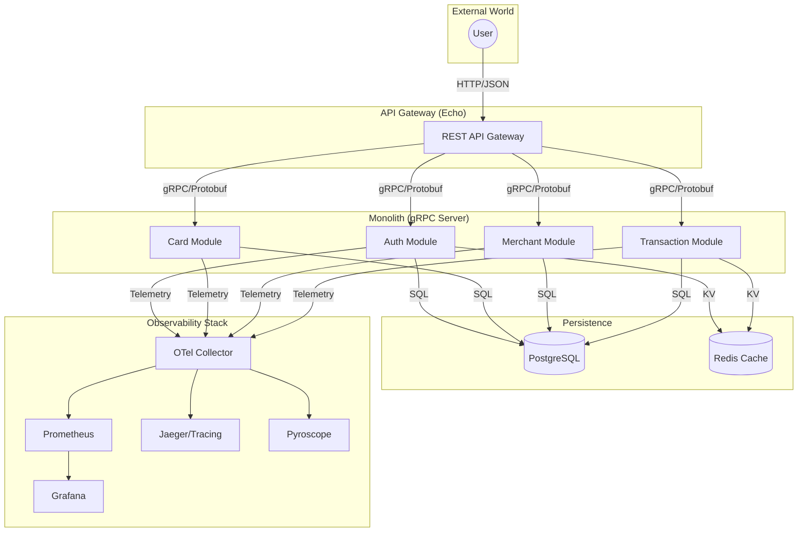
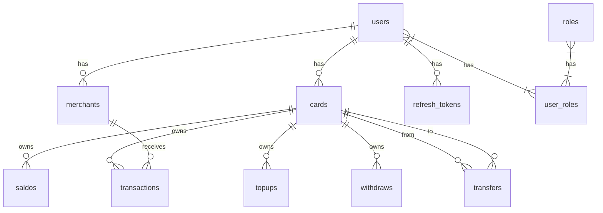

# Payment Gateway gRPC

[](https://golang.org/)
[](https://grpc.io/)
[](https://echo.labstack.com/)
[](https://www.docker.com/)

A high-performance, Monolith payment system implementation. This project demonstrates a production-ready architecture using gRPC for internal service communication and Echo for a RESTful API gateway, all wrapped in a robust observability stack.

---

## Table of Contents
- [Core Features](#core-features)
- [Technology Stack](#technology-stack)
- [Architecture](#architecture)
- [Database Schema](#database-schema)
- [Getting Started](#getting-started)
- [Project Commands (Justfile)](#project-commands-justfile)
- [Observability](#observability)
- [Testing & Performance](#testing--performance)
- [Preview](#preview)

---

## Core Features

- **Robust Authentication**: JWT-based auth with Refresh Token management.
- **Card Management**: Secure storage and retrieval of user payment cards.
- **Merchant Ecosystem**: Merchant onboarding and API key-based transaction processing.
- **Transaction Engine**: Handles complex payment flows between users and merchants.
- **Internal Transfers**: Peer-to-peer balance transfers between cards.
- **Wallet Operations**: Seamless Top-up and Withdrawal workflows.
- **Atomic Balance Management**: Consistent balance updates across all financial operations.

---

## Technology Stack

| Category | Tools |
| :--- | :--- |
| **Core** |    |
| **Database** |    |
| **Observability** |     |
| **Testing** |    |
| **DevOps** |    |

---

## Architecture

The project follows a Monolith pattern. The REST API (Echo) acts as a gateway that communicates via gRPC with internal modules. Each module is logically separated but shares a common infrastructure.



---

## Database Schema



> [!NOTE]
> This schema is managed using Goose migrations and SQLC for type-safe query generation.

---

## Getting Started

### Prerequisites
- Go 1.25.0+
- Docker & Docker Compose
- Just (Alternative to Make)

### Docker Setup (Fastest)
1.  **Initialize Environment**:
    ```bash
    cp docker.env .env
    ```
2.  **Start Services**:
    ```bash
    just docker-up
    ```
    API Gateway will be available at `http://localhost:5000`.

### Local Development
1.  **Spin up Dependencies**:
    ```bash
    docker-compose up -d postgres redis
    ```
2.  **Run Migrations**:
    ```bash
    just migrate
    ```
3.  **Start Components**:
    ```bash
    # Terminal 1: gRPC Server
    just run-server
    
    # Terminal 2: API Gateway
    just run-client
    ```

---

## Project Commands (Justfile)

We use `just` for task automation. Here are some common commands:

| Command | Description |
| :--- | :--- |
| `just migrate` | Apply database migrations |
| `just generate-proto` | Generate Go code from Protobuf definitions |
| `just generate-swagger` | Generate Swagger documentation |
| `just test` | Run tests with race detection |
| `just test-all` | Run all tests including integration tests |
| `just k6 <module> <type>` | Run performance tests (e.g., `just k6 card stress`) |
| `just hurl` | Run API integration tests using Hurl |
| `just fmt` | Format Go source code |

---

## Observability

This project features a comprehensive observability stack integrated via OpenTelemetry:

- **Metrics**: Exported to Prometheus and visualized in Grafana.
- **Tracing**: Distributed tracing via OTel gRPC/HTTP instrumentation.
- **Profiling**: Continuous profiling with Pyroscope.
- **Logging**: Structured logging using Uber Zap and OTel integration.

> Visit `http://localhost:3000` for pre-configured Grafana dashboards.

---

## Testing & Performance

### Unit & Integration Testing
We use Testcontainers to spin up ephemeral PostgreSQL and Redis instances for integration tests, ensuring tests are hermetic and reliable.
```bash
just test-all
```

### Performance Benchmarks (k6)
Comprehensive performance testing across modules:

| Module | VUs | Throughput | p95 Latency | Status |
| :--- | :--- | :--- | :--- | :--- |
| **User** | 1500 | ~3500 req/s | ~400ms | Stable |
| **Role** | 1500 | ~4000 req/s | ~350ms | Stable |
| **Card** | 1500 | ~3200 req/s | ~600ms | ⚠️ Error Spike (12.5%) |

---

## Preview

### Swagger Documentation


### Frontend Previews
| Web | Desktop |
| :---: | :---: |
|  |  |